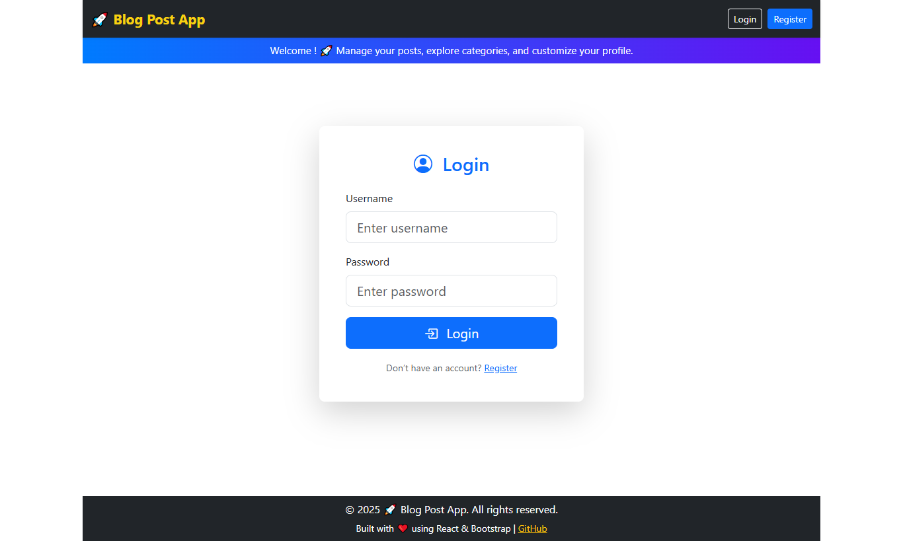
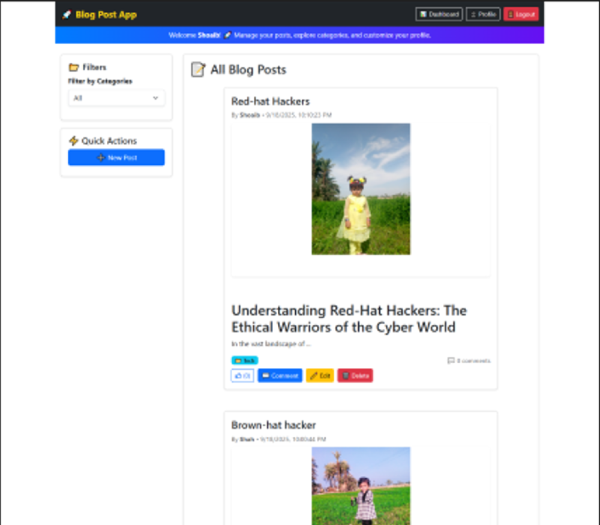
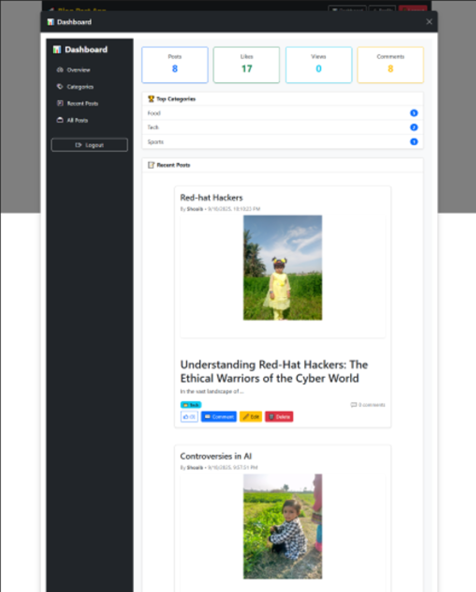

# 📰 Blog App (Django + React)

 
 
 

A full-stack blog application built with **Django REST Framework (DRF)** for the backend and **React** for the frontend.  
It includes **authentication, posts, categories, likes, comments, and a personal dashboard**.

---

## 🚀 Features

### 🔐 Authentication
- JWT-based login & signup  
- Protected API endpoints (posts, dashboard, likes, etc.)  
- User-specific actions (`my_posts`)  

### 📝 Posts
- Create, edit, and delete posts  
- Assign posts to categories  
- Upload optional post images  
- Pagination & filtering by category  
- Show author details  
- Track **views, likes, and comment counts**  
- `liked_by` flag so the frontend knows if the current user liked a post  

### ❤️ Likes 
- Toggle like/unlike a post  
- Show total `likes_count` per post  
- `liked_by` updates instantly in the UI  

### 💬 Comments
- Add comments on posts  
- Fetch comments dynamically  
- Display total `comment_count` per post  

### 📊 Dashboard
- User’s own posts (`/posts/my_posts/`)  
- Aggregated stats for admins/authors  
- Category-wise filtering  

### 🖥️ Frontend (React)
- Built with **React + Context API** for auth state  
- Integrated with backend via a centralized API layer (`api.js`)  
- Toast notifications for feedback  
- Responsive UI  

---

## 📸 Screenshots

Click on the screenshots to view full-size images:

| Homepage | Blog Post | Dashboard |
|----------|-----------|-----------|
| [](Images/02.png) | [](Images/04.png) | [](Images/8.png) |

> **Tip:** Use `_thumb` versions as smaller images for table display. Full-size images open when clicked.

---

## 🛠️ Tech Stack

**Backend**
- Python, Django, Django REST Framework  
- SimpleJWT for JWT authentication  
- SQLite  

**Frontend**
- React, Context API  
- Fetch API for requests  
- React-Toastify for notifications  

---

## ⚙️ Installation

### Backend (Django)
```bash
# Clone repo
git clone https://github.com/ShoaibJarwar/DjangoReactBlogApp.git
cd blog-app/blogapi

# Install dependencies
pip install -r requirements.txt

# Run migrations
python manage.py migrate

# Start server
python manage.py runserver
